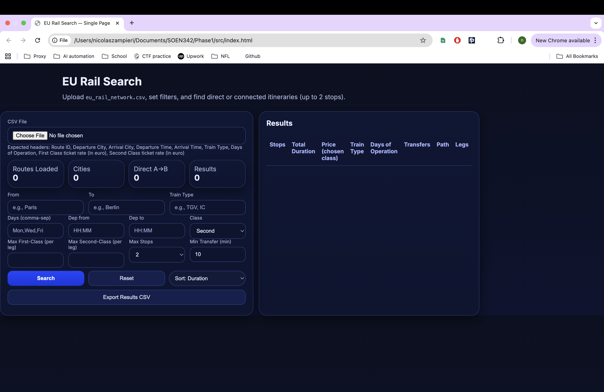

# SOEN342

SOEN 342 group project 2025

Members:

    Team lead: Nicolas Zampieri 40275624

    Luca Ieraci 40276520

    Marc Fadous 40276612

Iteration I:

Loads train routes from a CSV file and lets you search for direct and
indirect connections (up to 2 stops). Supports filtering by most fields
(except route ID), computes trip + transfer durations, and sorts results
by duration or price.

Notes & Assumptions:

- Times are interpreted as HH:MM (24h). If arrival < departure, we assume arrival is next day.
- For multi-leg journeys (connections), we require that each next leg departs on the SAME DAY
  as the previous leg's arrival and at least min_transfer minutes after arrival.
  (Overnight transfers are NOT considered in this version.)
- "Days of Operation" is matched as overlapping sets (e.g., 'Mon,Wed,Fri'). When searching on
  days, we require that the chosen day appears in ALL legs. If you supply multiple days as a list,
  any overlap is accepted (at least one day common across all legs).
- Sorting by price uses your chosen class (first or second) aggregated across legs.

Artifacts:

- All artifacts were completed prior to coding however they were uploaded onto GIT after the code. 
- The artifacts that we have are: Use case diagram, use cases, domain model, system sequence diagram, system operations, operation contract, interaction diagram and class diagram which were completed in thier respective order

How to run?

1) Open the index.html file

2) Upload the desired CSV file

3) Fill in search/filter requirements wanted for your trip

4) Enjoy a fully planned itinerary:)

